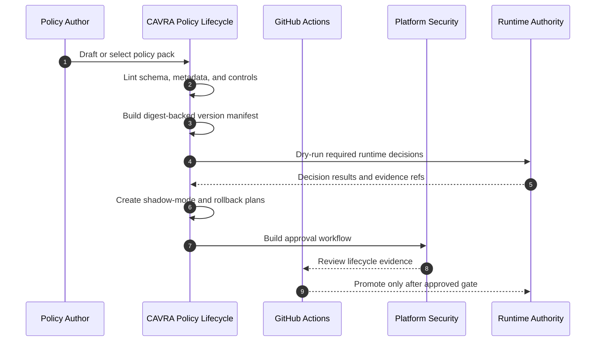

# Policy Lifecycle Tooling

CAVRA policy lifecycle tooling turns policy changes into a governed release path. It covers authoring UI contracts, schema and semantic linting, version manifests, shadow mode, dry-run simulation, rollback planning, and approval workflow evidence.

This page documents roadmap item R5.2. The public repo implements the lifecycle contract, CLI, validator, sample evidence, sanitized live example, CI workflow, and tests. Customer-specific screenshots, approval records, and production rollout evidence remain Enterprise deployment artifacts.

## Lifecycle Sequence



## Implemented Capabilities

| Capability | Implementation |
| --- | --- |
| Authoring UI contract | Draft editor, lint, semantic diff, simulator, shadow toggle, approval builder, and rollback picker surfaces. |
| Lint report | Policy schema, metadata, control presence, list field shape, and lifecycle warnings. |
| Version manifest | Policy ID, version, digest, previous digest, source reference, Git-version flag, and semantic diff. |
| Shadow mode plan | Non-enforcing rollout plan with evidence references and promotion criteria. |
| Dry-run report | Required decisions for sensitive read, policy write approval, Terraform plan/apply, protected branch push, and MCP trust. |
| Rollback plan | Approval-gated rollback steps and known-good rollback reference. |
| Approval workflow | Publish plan, approval decision, required evidence, approver groups, and review checklist. |
| Readiness gate | Sample/live packet validation with live-mode enforcement. |

## Commands

```bash
cavra policy lifecycle-plan --policy-pack cavra-ai-agent-baseline --output-dir dist/policy-lifecycle
cavra policy lifecycle-readiness examples/policy-lifecycle/enterprise-policy-lifecycle.live.sanitized.example.json --require-live
python scripts/validate_policy_lifecycle.py --policy-pack cavra-ai-agent-baseline --export-dir dist/policy-lifecycle
python scripts/validate_policy_lifecycle.py --packet examples/policy-lifecycle/enterprise-policy-lifecycle.live.sanitized.example.json --require-live
```

## Evidence Packets

- Sample: `examples/policy-lifecycle/enterprise-policy-lifecycle.sample.json`
- Sanitized live example: `examples/policy-lifecycle/enterprise-policy-lifecycle.live.sanitized.example.json`
- CI workflow: `.github/workflows/policy-lifecycle.yml`
- Tests: `tests/test_policy_lifecycle.py`

## Completion Gate

The live Enterprise gate is:

```bash
python scripts/validate_policy_lifecycle.py \
  --packet <live-policy-lifecycle-packet.json> \
  --require-live
```

Completion means:

```json
{
  "ready_for_live_policy_lifecycle": true,
  "blocker_count": 0
}
```
