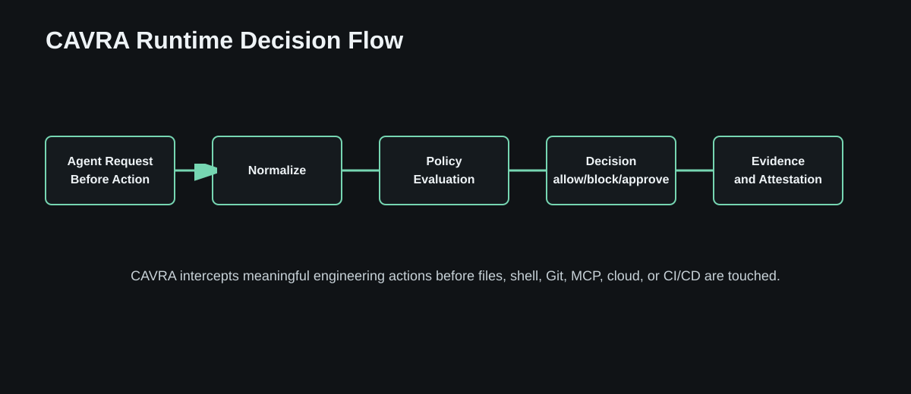
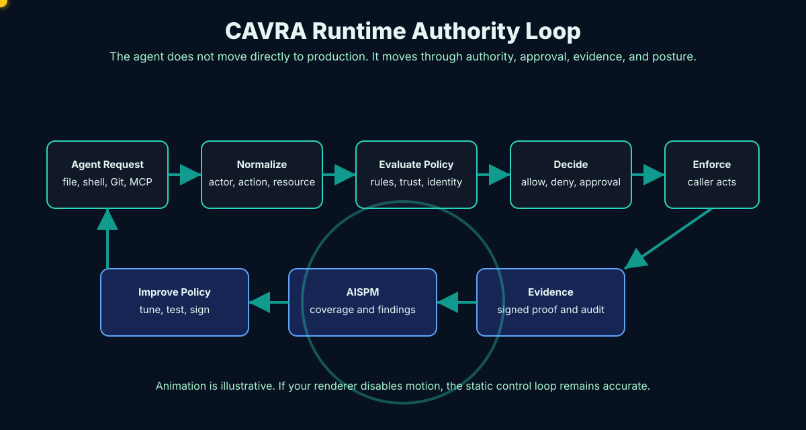

# Why CAVRA Exists

AI agents changed the software delivery threat model. Traditional application security tools inspect source code, dependencies, infrastructure definitions, and runtime services. Those tools are still necessary, but they do not govern the agent while it is operating.

An agent can combine many small actions into a high-impact workflow. It can inspect a repository, infer secrets from context, edit an IAM policy, run a shell command, call a deployment tool, change a GitHub workflow, and write persuasive justification in a pull request. Without a runtime authority layer, each step may look harmless while the workflow as a whole becomes risky.

## The New Risk Surface

CAVRA is designed around the risk that agentic systems create:

- Agents can act faster than review processes.
- Agents can cross boundaries between code, shell, cloud, Git, MCP, and CI/CD.
- Agents can generate plausible explanations for unsafe changes.
- Agents can operate through tools that were never designed for autonomous use.
- Agents can create evidence gaps when actions happen outside approved workflows.

The core problem is not that agents are malicious. The core problem is that an agent can be over-authorized, under-observed, or insufficiently constrained.

## A Small Action Can Become A Large Incident

Agentic risk compounds because agents are good at chaining tools. A file read can become a secrets exposure. A configuration edit can become an IAM escalation. A harmless-looking workflow change can disable the very CI gate that should have caught the problem. A direct push can bypass human review. A generated incident summary can make the path look intentional and clean even when the evidence is incomplete.

CAVRA treats these chains as operating reality. It does not assume that a single static scan or a final human review can reconstruct the full context. It evaluates the attempted action while the relevant context is still fresh:

- the agent identity,
- the requested action,
- the resource being touched,
- the policy pack in force,
- the trust level of any tool involved,
- the approval state,
- the evidence that must exist if the action proceeds.

## The CAVRA Answer

CAVRA introduces a runtime decision point before meaningful action. It asks:

- Who or what is acting?
- What operation is being attempted?
- Which repository, file, environment, identity, tool, or cloud object is affected?
- Which policy applies?
- Does this require human approval?
- What evidence must be generated?
- Should this be allowed, denied, shadowed, or routed for review?

## Why AISPM Matters

Runtime decisions are useful individually. They become more valuable when aggregated into posture. AISPM, AI Security Posture Management, turns CAVRA evidence into questions executives and operators can answer:

- Which agents are covered?
- Which tools are trusted?
- Which controls are enforced?
- Which findings remain open?
- Which reports are ready for security, compliance, or board review?
- Which blockers prevent a trial, pilot, or production launch?

CAVRA therefore covers both sides of the problem: pre-action enforcement and post-action posture.

## The Transformative Potential

When CAVRA is adopted well, teams do not have to choose between powerful AI automation and responsible control. Developers can use agents without handing them unrestricted production authority. Security teams can move from periodic review to live governance. Compliance teams can receive evidence that is generated by the control path itself rather than reconstructed after the fact. Executives can ask whether AI-agent coverage is improving and receive a posture answer, not a collection of anecdotes.

## What CAVRA Is Not

CAVRA is not a replacement for code review, SAST, DAST, SCA, secrets scanning, cloud posture management, IAM governance, or incident response. CAVRA works alongside those systems. Its unique role is runtime authority for agentic workflows.

If traditional tools answer "what is wrong with the artifact?", CAVRA answers "should this agent be allowed to perform this action right now, and what evidence proves the decision?"

## Check Your Understanding

1. Why can a chain of individually reasonable agent actions become unsafe?
2. What seven questions does CAVRA ask before meaningful action?
3. Why is AISPM more useful than a collection of isolated runtime decisions?

## What's Next

Read [The Runtime Authority Model](Textbook-02-Runtime-Authority-Model.md) to learn the actors, actions, decisions, and authority sources behind the control loop.
