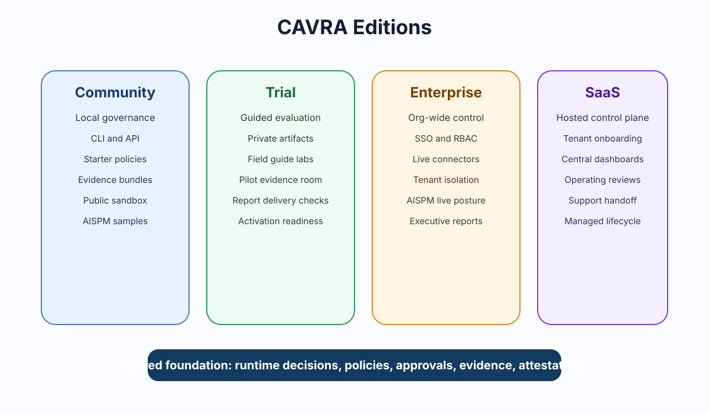

# Product Model, Licensing, And Capability Boundaries

CAVRA now uses a Community-first product model. The public repository is not a
limited demo or a separate "Community Edition" fork. It is **CAVRA Community**:
the full public, self-hosted product surface for runtime governance, policy
evaluation, approvals, evidence, AISPM, report center, dashboards, CI/CD
enforcement, connector interfaces, reference connectors, public policy packs,
and public contracts.



## Canonical Product Paths

| Product path | Meaning | Source boundary |
| --- | --- | --- |
| CAVRA Community | Full self-hosted public product and default codebase. | Public repository. |
| CAVRA Managed | Hosted CAVRA operated as a managed service. | Private managed-service operations and infrastructure. |
| CAVRA Enterprise Subscription | Commercial support, SLA, certified connectors, commercial policy packs, compliance packs, implementation help, and private customer operations. | Contracted commercial packages and support operations. |
| CAVRA Trial | Temporary evaluation access for CAVRA Managed or Enterprise Subscription capabilities. | Operator-reviewed evaluator access; not a separate source edition. |

## Capability Statuses

CAVRA no longer describes self-hostable capabilities as "Enterprise-only" just
because they need infrastructure. A capability should be described by its real
readiness state:

| Status | Meaning |
| --- | --- |
| `available` | Included in CAVRA Community or enabled by current configuration. |
| `requires_configuration` | Included in CAVRA Community, but the operator must configure a backing service such as identity, audit storage, report delivery, database, object storage, policy registry, or connector credentials. |
| `requires_managed_service` | Available through CAVRA Managed because it depends on hosted operation, billing, uptime, customer-success workflow, or managed service execution. |
| `requires_commercial_entitlement` | Available with Enterprise Subscription, certified connector package, commercial policy pack, compliance pack, or implementation support. |
| `unsupported` | Not recognized by the public capability registry. |
| `deprecated` | Kept only for old commands, payloads, docs links, or compatibility labels. |

## CAVRA Community Includes

- Runtime decisions, policy evaluation, approvals, and attestations.
- Evidence bundles, verification, audit-friendly metadata, and public schemas.
- AISPM posture, report center contracts, local/self-hosted dashboards, and public-safe samples.
- CI/CD enforcement and release governance contracts.
- Self-hosted tenant model and tenant context interfaces.
- Generic SSO/RBAC hooks and approval provider interfaces.
- Audit export framework and report delivery interface.
- Connector SDK, reference connectors, public policy packs, and public contracts.

If a Community operator has not configured identity, audit storage, report
delivery, object storage, database, policy registry, or connector credentials,
the product should say **requires configuration**, not **locked**.

## CAVRA Managed Includes

- Hosted tenant onboarding and managed tenant operations.
- Managed policy registry, managed dashboards, managed report delivery, and managed audit storage.
- Updates, monitoring, uptime operations, support handoff, customer-success operating review, and billing workflows.
- Private managed-service execution that is intentionally not shipped in the public repository.

## CAVRA Enterprise Subscription Includes

- Commercial support and SLA.
- Certified connectors and supported integration packages.
- Commercial policy packs and compliance packs.
- Implementation help, custom integrations, procurement/security review support, and private customer operations.
- Deployment assistance for self-hosted Community, CAVRA Managed, or hybrid customer environments.

Enterprise Subscription is a commercial relationship. It is not a separate
source edition.

## CAVRA Trial Access

CAVRA Trial is an approved evaluation path. It can provide hosted evaluator
access, time-limited entitlement material, private package access where still
needed, guided AISPM labs, expiry, revocation, audit evidence, and closeout.

Trial is not a product edition. Trial users should use the
[CAVRA Trial Field Guide](CAVRA-Trial-Field-Guide.md) and
[Trial Access Guide](Trial-Access-Guide.md) to prove one complete use case.

## Compatibility

Old labels still appear in some commands, payloads, release records, and
historical documents. They map as follows:

| Legacy label | Current meaning |
| --- | --- |
| Community Edition | CAVRA Community |
| Enterprise Edition | CAVRA Enterprise Subscription or a supported self-hosted deployment |
| SaaS | CAVRA Managed |
| Trial Edition | CAVRA Trial access |
| Enterprise-only feature | Requires configuration, managed service, or commercial entitlement depending on the capability |
| Locked feature | Not configured, managed-service capability, or commercial entitlement capability |

The code keeps legacy inputs such as `CAVRA_EDITION=enterprise`,
`CAVRA_EDITION=saas`, and old `LicenseEdition` values for compatibility. New
configuration should prefer:

```bash
CAVRA_DEPLOYMENT_MODE=community|managed|trial_access
CAVRA_COMMERCIAL_ENTITLEMENT=none|enterprise_subscription|managed
CAVRA_PROVIDER_PROFILE=local|self_hosted|managed
```

## What's Next

Read [Capability Configuration Guide](Capability-Configuration-Guide.md) to
understand which providers must be configured for self-hosted production use.
