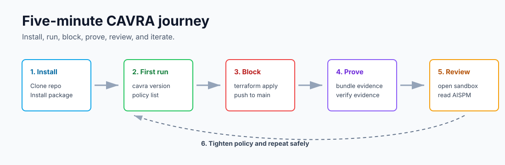
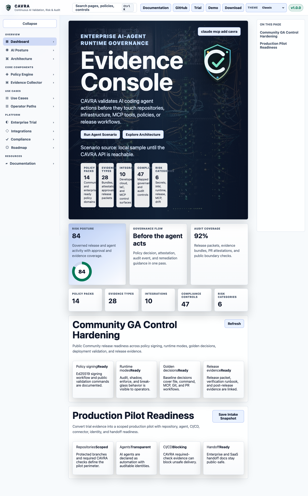

# Install And Deploy CAVRA

This chapter is the first practical path through CAVRA. It takes a new reader from a clean checkout to a visible blocked action, a verified evidence bundle, and the sandbox GUI.



The operating pattern is stable: install CAVRA, choose a policy pack, evaluate actions, generate evidence, and decide where enforcement belongs.

## Repository Setup

Clone the public repository:

```bash
git clone https://github.com/Huzefaaa2/cavra.git
cd cavra
```

Install the Python package in editable mode for local development:

```bash
python -m venv .venv
source .venv/bin/activate
pip install -e .
```

If CAVRA is available from your Python package index, use an isolated CLI install instead:

```bash
pipx install cavra
```

For source development, keep the editable install. For daily CLI use, prefer `pipx` or a dedicated virtual environment so CAVRA dependencies do not mix with application dependencies.

Validate the CLI:

```bash
cavra version
cavra policy list
```

## Five-Minute Tutorial: Block A Dangerous Agent Action

Start with the flagship demo:

```bash
cavra demo before-the-agent-acts
```

Expected decisions:

| Attempted action | Expected CAVRA outcome |
| --- | --- |
| Read `.env` | Blocked |
| Modify `iam/admin-role.tf` | Requires approval |
| Run `terraform plan` | Allowed |
| Run `terraform apply -auto-approve` | Blocked |
| Use unknown filesystem MCP server | Blocked |
| Push directly to `main` | Blocked |
| Open a pull request | Allowed with attestation |

Now evaluate one risky command directly:

```bash
cavra evaluate execute_command "terraform apply -auto-approve" --json
```

The decision payload tells you the action, target, policy mode, decision, reason, and evidence expectations. In a real agent workflow, the agent or wrapper should stop when the decision is `block` or `requires_approval`.

Evaluate a risky file write:

```bash
cavra evaluate write_file iam/admin-role.tf --json
```

Evaluate a direct protected-branch push:

```bash
cavra evaluate git_operation origin/main --json
```

Evaluate an unknown MCP tool path:

```bash
cavra evaluate mcp_tool_call unknown-filesystem --json
```

## Generate And Verify Evidence

Create evidence after the demo:

```bash
cavra evidence bundle --output .cavra/evidence/latest
cavra evidence verify .cavra/evidence/latest
```

For signed verification, create a keypair and trust root first:

```bash
cavra evidence generate-keypair
cavra evidence trust-root .cavra/keys/evidence-ed25519-public.pem --key-id local-evidence-key
cavra evidence trust-bundle .cavra/keys/evidence-trust-root.json
cavra evidence bundle --output .cavra/evidence/latest --private-key .cavra/keys/evidence-ed25519-private.pem --key-id local-evidence-key
cavra evidence verify .cavra/evidence/latest --trust-root .cavra/keys/evidence-trust-root.json
```

The important learning is that CAVRA does not only say "allowed" or "blocked." It creates a record that can later support review, CI/CD checks, AISPM posture, or audit.

## Local Evaluation Patterns

Use these commands as your first local test set:

```bash
cavra evaluate write_file iam/admin-role.tf --json
cavra evaluate execute_command "terraform plan" --json
cavra evaluate execute_command "terraform apply -auto-approve" --json
cavra evaluate git_operation origin/main --json
```

Use JSON output for automation and evidence workflows. Use `cavra policy explain` when the decision is surprising:

```bash
cavra policy explain execute_command "terraform apply -auto-approve"
```

## Sandbox GUI

The public sandbox is a static UI under `apps/sandbox-ui`. Run it locally:

```bash
python -m http.server 5173 --directory apps/sandbox-ui
```

Open `http://localhost:5173` and explore the dashboard, demo scenarios, evidence console, approvals, registry views, and AISPM pages.



## Docker And Compose

The repository includes Docker examples for local evaluation and demo environments:

- `docker-compose.yml`
- `docker/docker-compose.community.yml`
- `examples/docker/README.md`

Use Docker when you want repeatable local startup or a shared demo environment. Use the Python editable install when you are modifying policy, CLI, or source behavior.

## API Deployment

CAVRA includes a public API surface for decisions, policy packs, approvals, evidence, AISPM samples, and sandbox workflows. See [API](API.md) for endpoint families. A local deployment normally starts the API, configures policy and storage paths, then allows the sandbox UI or automation scripts to call the API.

## Azure Community SaaS Deployment

The public Community repository includes an Azure deployment path for teams that
want to run CAVRA as a lightweight hosted Community service instead of only as a
local CLI or static sandbox.

The pattern uses:

- Azure Container Apps for the CAVRA FastAPI backend.
- Azure Static Web Apps for the sandbox and AISPM sample UI.
- Azure Container Registry for the API container image.
- GitHub Actions with Azure OIDC for deployment.

The implementation files are:

- `docker/Dockerfile.azure-api`
- `.github/workflows/deploy-azure-api.yml`
- `.github/workflows/deploy-azure-static-ui.yml`

The API container runs:

```bash
uvicorn cavra.api:app --host 0.0.0.0 --port 8000
```

The static UI workflow writes a deployment-specific `config.js` so the browser
uses the published API endpoint. Operators configure `CAVRA_PUBLIC_API_BASE_URL`
for the UI and `CAVRA_CORS_ORIGINS` for the API.

Use [Azure Community SaaS Deployment](Azure-Community-SaaS-Deployment.md) for the
full Azure resource list, GitHub variables, deployment flow, and validation
steps.

This path is intentionally Community-scoped. It publishes public-safe CAVRA
surfaces; it does not add Enterprise tenant isolation, live connectors, private
policy packs, report-provider delivery, license enforcement, or AISPM production
readiness validation.

## CI/CD Deployment

CAVRA can be used in CI/CD to require policy decisions and evidence before merging or deploying. A typical flow is:

1. A pull request proposes a high-risk change.
2. CAVRA evaluates the change.
3. Required approvals are opened or verified.
4. Evidence is generated.
5. A CI required check verifies the evidence and attestation.

See [GitHub Required Checks And CI/CD Enforcement](GitHub-Required-Checks-and-CI-CD-Enforcement.md) and [Evidence Hub And Attestation](Evidence-Hub-and-Attestation.md).

Example workflow files are available under:

- `examples/github-actions/cavra-required-check.yml`
- `examples/github-actions/cavra-enterprise-enforcement.yml`
- `examples/gitlab-ci/cavra-required-check.gitlab-ci.yml`

## Enterprise Deployment

Enterprise deployment adds SSO, RBAC, tenant configuration, live connectors, private policy packs, report delivery, and AISPM live ingestion. Use [Enterprise Trial Self-Service Access](Enterprise-Trial-Self-Service-Access.md), [OIDC RBAC Deployment](OIDC-RBAC-Deployment.md), [Connector Execution Hooks](Connector-Execution-Hooks.md), and [AISPM Enterprise Live Ingestion](AISPM-Enterprise-Live-Ingestion.md) as the main references.

On Azure, Trial and Enterprise deployment use the private
`Huzefaaa2/cavra-enterprise` workflow set:

- `deploy-azure-trial-api.yml`
- `deploy-azure-trial-ui.yml`
- `deploy-azure-enterprise-api.yml`
- `deploy-azure-enterprise-ui.yml`
- `deploy-azure-enterprise-connectors.yml`
- `validate-azure-aispm-production.yml`

The Trial path hosts the approved-access portal, license request workflow,
time-limited licenses, private package delivery, guided AISPM labs, expiry,
revocation, audit evidence, and closeout. The Enterprise path hosts the private
control plane with Entra ID/OIDC, RBAC, tenant isolation, private policy packs,
persistent audit/evidence stores, SMTP/report-provider integration, live
connectors, runtime workflow validation, and the final AISPM production
readiness gate.

Use [Azure Trial And Enterprise Deployment](Azure-Trial-And-Enterprise-Deployment.md)
for the public-safe architecture. The executable workflows and secrets stay in
the private Enterprise repository.

Enterprise deployment models:

| Model | Use when | Key work |
| --- | --- | --- |
| Self-hosted control plane | You need private deployment and customer-controlled evidence stores. | Configure identity, policy registry, tenant audit store, connectors, and report delivery. |
| Docker or Compose | You need repeatable pilot or lab environments. | Pin images, mount policy/evidence paths, and keep secrets outside source control. |
| Kubernetes or Helm-style deployment | You need production-grade scheduling, ingress, secret management, and observability. | Add SSO/RBAC, persistent stores, network policy, connector credentials, and readiness probes. |
| Air-gapped or regulated environment | You need offline evidence, reproducible packages, or restricted network paths. | Use signed packages, offline trust roots, immutable storage, and export workflows. |

## Deployment Checklist

- Confirm edition and license boundary.
- Select policy packs.
- Configure evidence storage and trust roots.
- Configure approvals and break-glass rules.
- Configure agent and MCP trust registry entries.
- Add CI/CD enforcement where required.
- For Enterprise, configure tenant identity, connectors, SMTP or report provider settings, runtime workflows, and AISPM ingestion.
- Run readiness validators before production launch.

## First Success Criteria

You have completed the first onboarding path when:

- `cavra demo before-the-agent-acts` shows blocked, approval-routed, allowed, and attested outcomes.
- `cavra evaluate execute_command "terraform apply -auto-approve" --json` returns a blocking decision under the starter policy.
- `cavra evidence bundle` creates an evidence directory.
- `cavra evidence verify` succeeds.
- The sandbox GUI opens and you can identify Dashboard, Evidence, Approval, Registry, and AI Posture areas.

## Check Your Understanding

1. Which command gives the fastest proof that CAVRA can block a risky action?
2. Why should trust roots be configured before evidence is used in CI/CD or audit?
3. What is the difference between serving the sandbox GUI and running Enterprise live ingestion?

## What's Next

Read [Community Edition User Guide](Textbook-06-Community-Edition-User-Guide.md) to turn the installation into repeatable local governance workflows.
