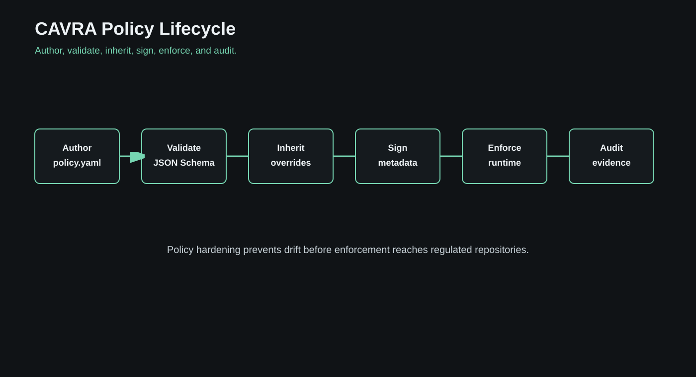
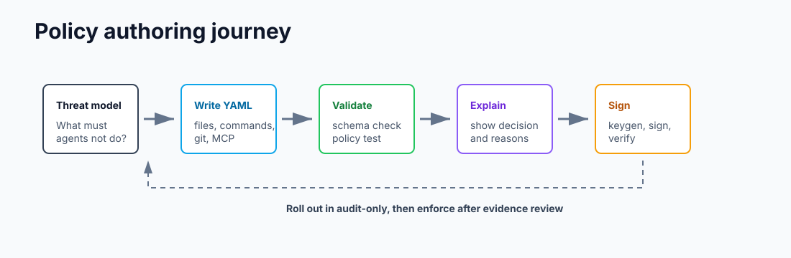

# Community Edition User Guide

Community Edition is the public, local-first way to learn and use CAVRA. It is suitable for demonstrations, repository-level governance, policy authoring, evidence experiments, and public-safe AISPM exploration.

## What You Can Do

Community users can:

- Evaluate proposed file, command, Git, or tool actions.
- Use starter policy packs.
- List, validate, test, explain, sign, and verify policies.
- Create and process approval records.
- Generate evidence bundles.
- Verify evidence and PR attestations.
- Register agents and MCP servers.
- Run the sandbox GUI.
- Explore public-safe AISPM posture and report center views.

## First Decision

Run:

```bash
cavra evaluate write_file iam/admin-role.tf --json
```

Review the output. The important fields are the action, resource, decision, reasons, policy references, and evidence expectations. If the action requires approval, create an approval request:

```bash
cavra approval create /tmp/cavra-decision.json --requested-by developer
```

Approve or deny it:

```bash
cavra approval approve apr_123 --actor platform-security --reason "Scoped IAM change reviewed"
cavra approval deny apr_123 --actor platform-security --reason "Missing rollback plan"
```

## Tutorial: Protect Your Git Main Branch

Goal: stop an agent from bypassing pull request review.

```bash
cavra evaluate git_operation origin/main --json
```

Expected behavior: the starter policy blocks direct push to protected branches. In a CI/CD path, the same control should become a required check that verifies CAVRA evidence before merge.

Next, route normal work through a pull request and evidence path:

```bash
cavra evidence bundle --output .cavra/evidence/pr-123
cavra evidence verify .cavra/evidence/pr-123
```

Use this tutorial when you want a developer to understand the simplest CAVRA rule: agents can help, but they should not bypass the protected delivery path.

## Tutorial: Audit Shell Commands

Goal: separate safe command exploration from dangerous execution.

```bash
cavra evaluate execute_command "terraform plan" --json
cavra evaluate execute_command "terraform apply -auto-approve" --json
cavra evaluate execute_command "kubectl delete namespace production" --json
```

Expected behavior: low-risk planning commands are allowed or recorded, while destructive or auto-approved production commands are blocked or routed for approval depending on the policy pack.

## Tutorial: Generate A Compliance-Oriented Evidence Bundle

Goal: prove that policy, approval, and evidence are connected.

```bash
cavra evidence generate-keypair
cavra evidence trust-root .cavra/keys/evidence-ed25519-public.pem --key-id local-evidence-key
cavra evidence bundle --output .cavra/evidence/compliance-demo --classification regulated-sdlc --private-key .cavra/keys/evidence-ed25519-private.pem --key-id local-evidence-key
cavra evidence verify .cavra/evidence/compliance-demo --trust-root .cavra/keys/evidence-trust-root.json
```

The bundle can feed CI/CD checks, local review, SIEM export experiments, and AISPM posture samples.

## Policy Workflow

Community policy work normally follows this path:

```bash
cavra policy list
cavra policy validate
cavra policy test
cavra policy explain
cavra policy sign
cavra policy verify
```

Policies should be treated like code. They need review, tests, signing, and clear rollout modes.





Start by copying or initializing a starter policy:

```bash
cavra policy init --destination .cavra/policy.yaml
cavra policy validate .cavra/policy.yaml
cavra policy test --policy-pack cavra-ai-agent-baseline
```

Then explain decisions before changing enforcement:

```bash
cavra policy explain execute_command "terraform apply -auto-approve"
cavra policy explain write_file iam/admin-role.tf
```

## Evidence Workflow

Evidence allows users and automation systems to prove that a decision occurred and that the expected enforcement path was used.

```bash
cavra evidence generate-keypair --private-key .cavra/keys/evidence-private.pem --public-key .cavra/keys/evidence-public.pem
cavra evidence bundle --output .cavra/evidence/latest --key "$CAVRA_EVIDENCE_SIGNING_KEY"
cavra evidence verify .cavra/evidence/latest --trust-root .cavra/keys/evidence-trust-roots.json
cavra evidence verify-attestation .cavra/evidence/latest
```

## Sandbox Workflow

The sandbox is the fastest way to understand CAVRA visually:

1. Open the Dashboard.
2. Run the "Before the Agent Acts" scenario.
3. Review decisions and blocked actions.
4. Open Evidence.
5. Open AI Posture.
6. Export public-safe report or readiness packets.


## Community Limits

Community Edition intentionally avoids storing private enterprise tenant data, live production connector credentials, or paid enterprise source. When you need SSO, RBAC, tenant isolation, private policy packs, live production connectors, production report delivery, and live AISPM ingestion, move to the Enterprise evaluation path.
