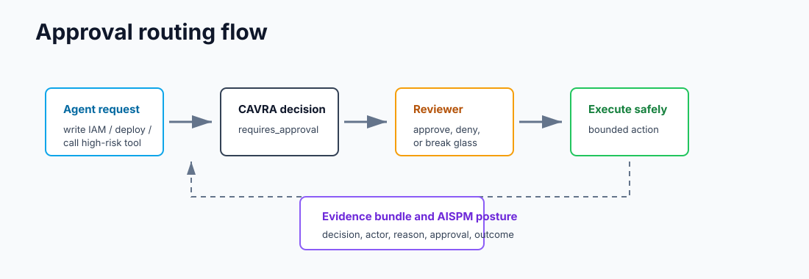

# Enterprise Edition User Guide

Enterprise Edition extends CAVRA from local governance into organization-wide agentic control. It is intended for platform security, application security, cloud security, release engineering, compliance, and executive reporting teams.

## Enterprise Responsibilities

Enterprise operators manage:

- Tenant identity and isolation.
- SSO and RBAC.
- Private policy packs.
- Live connector credentials.
- Approval routing.
- Runtime workflow enforcement.
- Evidence storage and retention.
- AISPM live ingestion.
- Report delivery.
- Pilot and production readiness gates.

## Tenant Setup

A production tenant needs:

- Tenant ID and display name.
- SSO provider configuration.
- RBAC role mappings.
- Repository and environment inventory.
- Policy pack assignment.
- Evidence store path or provider.
- Connector configuration.
- Report delivery recipients.
- Operating contacts and escalation routes.

See [Tenant Onboarding Contract](Tenant-Onboarding-Contract.md), [Tenant Audit Store Operating Contract](Tenant-Audit-Store-Operating-Contract.md), and [Entitlement Status Contract](Entitlement-Status-Contract.md).

## Evaluator Walkthrough

An Enterprise evaluation should not start with every possible feature. Start with one tenant, one repository, one high-risk workflow, one connector path, and one report recipient group.

1. Create or select the evaluation tenant.
2. Assign evaluator, security reviewer, operator, and report-recipient roles.
3. Attach a policy pack to one repository or workflow.
4. Run a governed agent workflow that attempts file, command, Git, and MCP activity.
5. Route one approval and one denied action.
6. Generate evidence and ingest it into AISPM.
7. Deliver one report through the configured SMTP/provider path.
8. Confirm the readiness packet has no blockers before expanding scope.

This keeps the evaluation measurable. The question is not "does the dashboard look complete?" The question is "did real runtime authority, evidence, report delivery, and tenant isolation work end to end?"

## Connector Setup

Enterprise connectors can deliver or retrieve evidence, tickets, alerts, reports, and operating records. Typical connector families include:

- SIEM.
- ITSM.
- ChatOps.
- SMTP or report delivery provider.
- GitHub, GitLab, Azure DevOps, and CI/CD systems.
- Cloud and endpoint inventory systems.
- Private queues or internal webhooks.

Connector configuration should always avoid storing secrets in source control. Use environment variables, secret stores, or deployment-level secret management.

## Report Delivery Setup

Enterprise report delivery normally requires:

- SMTP or report-provider host, port, TLS setting, and sender identity.
- Recipient policies for security, compliance, executive, and operator reports.
- Delivery audit event storage.
- Retry and escalation policy.
- Redaction policy for report content and provider logs.
- Evidence that at least one validation report was delivered successfully.

Treat report delivery as a production control. A generated report that never reaches the right reviewer is not operationally complete.

## Runtime Workflow Validation

Before production, Enterprise users must run validators against real workflows:

- Live ingestion.
- Streaming.
- Connector delivery.
- Tenant isolation.
- SMTP or provider report delivery.
- Agent and tool workflows.
- Runtime control enforcement.
- AISPM production readiness gate.

The production completion condition is a final packet that returns `ready_for_aispm_production: true` with no blockers.

## What Good Looks Like

| Area | Ready signal |
| --- | --- |
| Tenant isolation | Cross-tenant evidence, policy, report, and connector access is denied. |
| SSO/RBAC | Role mappings match evaluator, reviewer, operator, and executive responsibilities. |
| Runtime workflow | Real agent/tool activity passes through CAVRA rather than only fixture payloads. |
| Connectors | Delivery succeeds or fails with auditable retry evidence. |
| AISPM | Findings, coverage, reports, and blockers are traceable to source evidence. |
| Report delivery | Validation report is delivered to approved recipients and recorded. |
| Production gate | Final readiness packet returns ready with no blockers. |

## Enterprise Operating Reviews

After launch, Enterprise teams should use recurring operating reviews:

- Weekly posture review.
- Open finding review.
- Approval and exception review.
- Report delivery audit.
- Tenant isolation audit.
- Connector health review.
- Security advisory drill.
- Production readiness archive closeout.

These reviews are described through the product contract pages and preserved historical records in [Development And Testing Artifacts](Development-And-Testing-Artifacts.md).
