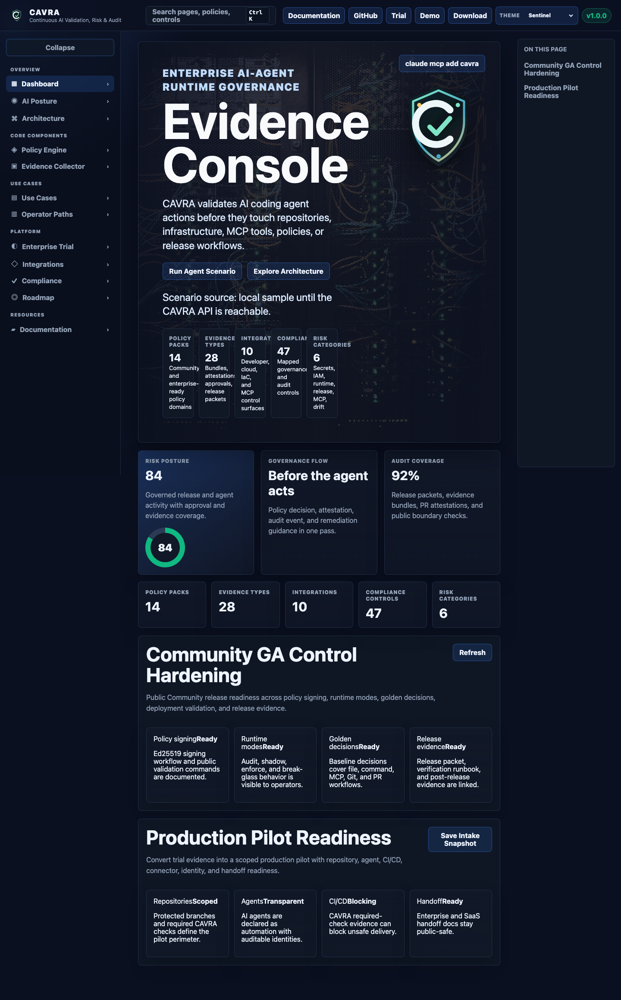

# CAVRA GUI And Sandbox Guide

The CAVRA sandbox GUI is the fastest way to see the product. It is a static-hostable interface that demonstrates runtime decisions, evidence, approvals, registry views, AISPM posture, report center flows, trial readiness, and operating packets.

Run it locally:

```bash
python -m http.server 5173 --directory apps/sandbox-ui
```

Open `http://localhost:5173`.

## Dashboard

The Dashboard introduces the operating surface: platform summary, decision flow, active scenarios, policy mode, risk signals, and evidence output.


Use the Dashboard to understand the "before the agent acts" journey. A user chooses or runs a scenario, CAVRA evaluates actions, and the UI shows allowed, blocked, or approval-routed decisions.

## Demo

The demo route presents scripted agent scenarios. It is useful for sales engineering, onboarding, internal training, and explaining runtime authority to non-developers.

## AI Posture

AI Posture is the AISPM surface. It shows posture, findings, control coverage, timeline, readiness checks, report center data, trial closeout evidence, pilot packets, evidence room status, and production readiness concepts.


## Evidence

The Evidence view shows how CAVRA records decisions and artifacts. Users can inspect evidence metadata, verify PR attestation, search indexed evidence, and understand which controls produced proof.

## Approvals

The approval surface shows pending approvals, routed decisions, break-glass activity, and audit details. Enterprise deployments connect this workflow to SSO, RBAC, ITSM, ChatOps, or internal provider workflows.

## Registry

The registry surface helps users inspect governed agents and MCP trust records. This is important because agents do not only edit code; they also call external tools. The registry explains which tools are approved, which capabilities they expose, and what trust tier applies.

## Settings And Themes

The sandbox includes multiple visual themes and route states. Theme screenshots are preserved in the wiki assets:



## GUI Sections Checklist

| Section | Purpose |
| --- | --- |
| Dashboard | Product overview, scenario state, runtime decisions. |
| Demo | Guided before-the-agent-acts story. |
| AI Posture | AISPM posture, findings, reports, readiness packets. |
| Evidence | Evidence inspection, metadata, attestation, bundles. |
| Approvals | Approval queue, decision records, break-glass activity. |
| Registry | Agent registry, MCP trust registry, profiles, classifications. |
| Settings | Theme, mode, local portal behavior. |

## Hosted Sandbox

The public hosted sandbox is documented in [Hosted Sandbox Deployment](Hosted-Sandbox-Deployment). In production-like environments, configure API base URLs and CORS policies so the static UI can query backend decisions and evidence.
