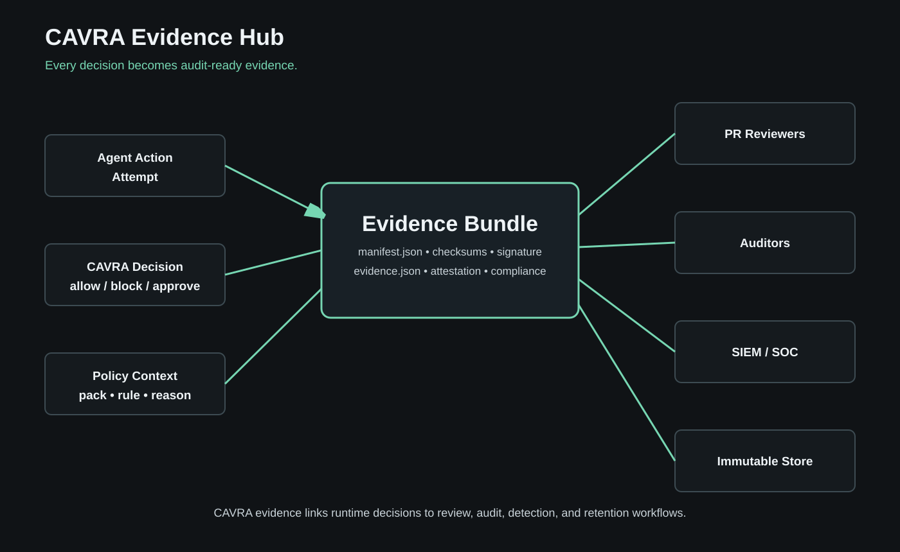

# Policies, Approvals, Evidence, And Attestations

CAVRA works because policies, approvals, evidence, and attestations are connected. A policy without evidence is hard to audit. Evidence without policy is hard to interpret. Approval without both is hard to trust.

## Policy Packs

Policy packs define what agents can do. A policy can account for action type, resource path, repository, environment, command class, MCP capability, trust tier, identity claims, and evidence requirements.

Good policy packs are:

- Specific enough to block risky behavior.
- Testable.
- Signed when used in stricter workflows.
- Mapped to rollout modes.
- Reviewed with the same discipline as infrastructure code.


## Policy Language: Starter Shape

CAVRA policy packs are YAML rule sets. A compact starter policy looks like this:

```yaml
metadata:
  id: cavra-community-starter
  title: CAVRA Community Starter Policy
  version: 0.1.0

filesystem:
  block_read:
    - ".env"
    - "**/secrets.*"
  block_write:
    - "**/.terraform/**"
  require_approval_write:
    - "iam/**"
    - "**/*prod*.tf"

commands:
  allow:
    - "terraform plan*"
    - "terraform validate*"
  block:
    - "terraform apply -auto-approve"
    - "terraform destroy*"
    - "kubectl delete*"
  require_approval:
    - "aws iam*"

git:
  block_push_branches:
    - main
    - master
  require_pull_request: true
  require_ai_attestation: true

mcp:
  allowlist_enabled: true
  allowed_servers:
    - github-mcp
  blocked_servers:
    - unknown-filesystem
```

The core sections are:

| Section | What it controls | Example |
| --- | --- | --- |
| `metadata` | Policy identity, title, version, and review metadata. | `id: cavra-community-starter` |
| `filesystem` | File reads, writes, and approval-routed paths. | Block `.env`; require approval for `iam/**`. |
| `commands` | Shell command allow, block, and approval patterns. | Allow `terraform plan`; block `terraform destroy`. |
| `git` | Branch and pull-request safety rules. | Block direct push to `main`. |
| `mcp` | MCP server and tool trust boundaries. | Allow `github-mcp`; block unknown filesystem tools. |

## Policy Authoring Workflow

Use this workflow when introducing or changing policy:

```bash
cavra policy init --destination .cavra/policy.yaml
cavra policy validate .cavra/policy.yaml
cavra policy test --policy-pack cavra-ai-agent-baseline
cavra policy explain execute_command "terraform apply -auto-approve"
cavra policy diff policies/community/starter-policy-1.yaml .cavra/policy.yaml
cavra policy keygen
cavra policy sign .cavra/policy.yaml --signer platform-security --private-key .cavra/policy-signing/local-policy-signing-key.private.pem --key-id local-policy-signing-key
cavra policy verify .cavra/policy.yaml --public-key .cavra/policy-signing/local-policy-signing-key.public.pem
```

Start in audit-only or shadow mode when introducing rules to an existing team. Move to enforce or strict mode only after evidence shows that normal work is not being blocked accidentally.

## Common Policy Recipes

Protect secrets:

```yaml
filesystem:
  block_read:
    - ".env"
    - "**/*.pem"
    - "**/secrets/**"
    - "*.tfvars"
```

Protect production infrastructure:

```yaml
filesystem:
  require_approval_write:
    - "infra/prod/**"
    - "iam/**"
commands:
  allow:
    - "terraform fmt*"
    - "terraform plan*"
  block:
    - "terraform apply -auto-approve"
    - "terraform destroy*"
```

Protect source-control review:

```yaml
git:
  block_push_branches:
    - main
  require_pull_request: true
  require_human_reviewer: true
  require_ai_attestation: true
```

Control MCP tools:

```yaml
mcp:
  allowlist_enabled: true
  allowed_servers:
    - github-mcp
  blocked_servers:
    - unknown-filesystem
```

## Approval Workflows

Some actions should not be automatically allowed or denied. They should be routed. CAVRA supports approval creation, listing, approval, denial, expiration, break-glass, notification export, provider request generation, provider delivery, and migration.


Use approvals when:

- The action is high impact but legitimate.
- The action changes production, identity, cloud, or CI/CD.
- The policy requires human review.
- The organization needs external change-management evidence.

See [Approval Workflows](Approval-Workflows.md).

Approval command path:

```bash
cavra evaluate write_file iam/admin-role.tf --json > /tmp/cavra-decision.json
cavra approval create /tmp/cavra-decision.json --requested-by developer
cavra approval list --state pending
cavra approval approve apr_123 --actor platform-security --reason "Scoped IAM change reviewed"
```

## Evidence Hub

The Evidence Hub records what happened and why.



Evidence can include:

- Decision payloads.
- Policy references.
- Approval records.
- Attestation files.
- Trust roots and signatures.
- Connector delivery records.
- SIEM export events.
- Retention plans.
- Search metadata.
- AISPM report packets.

## PR Attestation

PR attestation connects runtime evidence to code review. A CI check can verify that the pull request includes valid CAVRA evidence and that the attestation matches the expected bundle.

Use this pattern when teams want GitHub branch protection to require governed agent activity before merge.

## Break Glass

Break glass is not a bypass. It is an emergency workflow that requires explicit actor identity, reason, external reference, and evidence. Break-glass usage should be reviewed after the incident and included in AISPM posture.

## Trust Roots

Evidence verification depends on trust roots. Treat evidence signing keys and trust-root bundles as security-critical operating assets. Rotate keys on schedule, restrict write access, and verify bundles in CI/CD and audit workflows.

## Troubleshooting Policy Decisions

When a decision surprises you, use this sequence:

1. Confirm the action type and resource are what you intended.
2. Run `cavra policy explain <action> <target>`.
3. Check the policy pack ID and policy mode.
4. Confirm glob patterns match the resource path.
5. Check whether MCP trust, Git branch, or command class rules are taking precedence.
6. If the decision is too strict, adjust the policy and rerun `cavra policy validate` and `cavra policy test`.
7. If the decision is too permissive, add a narrower rule and generate evidence showing the new behavior.

Common causes:

| Symptom | Likely cause | Fix |
| --- | --- | --- |
| Safe command is blocked | Pattern is too broad. | Replace broad command glob with exact command families. |
| Risky file write is allowed | Path does not match policy glob. | Add explicit path or directory rule. |
| Approval is never created | Decision is `allow` or `block`, not `requires_approval`. | Move the rule from block/allow into approval routing. |
| Evidence verification fails | Missing trust root or wrong key ID. | Regenerate trust root and verify with the expected key. |

## Check Your Understanding

1. Why is break glass not the same thing as bypass?
2. Which artifact connects runtime governance to pull request review?
3. What should you check first when evidence verification fails?

## What's Next

Read [Operations, Integrations, And Deployment Patterns](Textbook-12-Operations-Integrations-And-Deployment-Patterns.md) for integration patterns, then [Policy Language Reference](Textbook-15-Policy-Language-Reference.md) for complete policy syntax.
