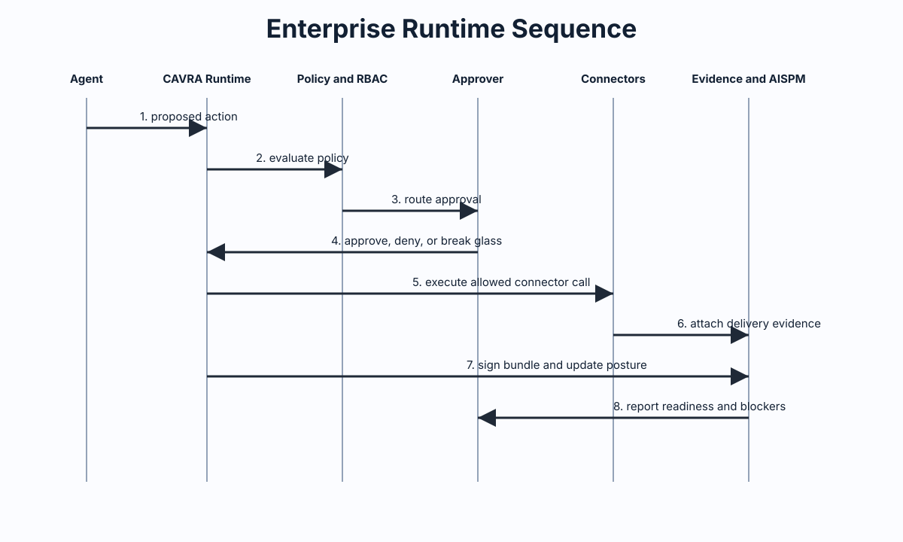
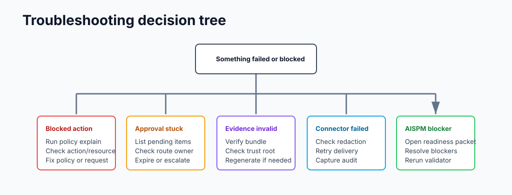

# Operations, Integrations, And Deployment Patterns

CAVRA can run locally, inside CI/CD, next to a hosted API, or as part of an Enterprise control plane. The right pattern depends on scope.

## Local Pattern

Use local mode for learning, policy authoring, demos, and repository-specific workflows.

```bash
cavra evaluate write_file src/example.py --json
cavra evidence bundle --output .cavra/evidence/latest
```

Use local mode to answer: "What would CAVRA do if this agent tried the action on my laptop or in this repository?"

## Claude Code Pattern

CAVRA includes a Claude Code initialization path and examples under `examples/claude-code`.

```bash
cavra init claude-code
cavra demo before-the-agent-acts
```

The integration model is:

1. Claude Code or another coding agent proposes an action.
2. A wrapper, hook, or local workflow normalizes that action into a CAVRA request.
3. CAVRA evaluates file, command, Git, or MCP activity.
4. The agent proceeds only on allowed decisions.
5. High-risk actions are blocked or routed for approval.
6. Evidence is generated for later review.

Start with the sample policy in `examples/claude-code/sample-policy.yaml`, then move recurring rules into a reviewed policy pack.

## CI/CD Pattern

Use CI/CD when CAVRA decisions should become required checks. The workflow normally:

1. Evaluates proposed changes.
2. Generates evidence.
3. Verifies evidence or PR attestation.
4. Blocks merge or deployment if the gate fails.

GitHub Actions examples:

- `examples/github-actions/cavra-required-check.yml`
- `examples/github-actions/cavra-enterprise-enforcement.yml`
- `examples/github-actions/cavra-aispm-review-packet-validation.yml`

GitLab CI examples:

- `examples/gitlab-ci/cavra-required-check.gitlab-ci.yml`
- `examples/gitlab-ci/cavra-aispm-review-packet-validation.gitlab-ci.yml`

Use CI/CD for protected branches, production Terraform changes, release governance, evidence verification, and AISPM review-packet validation.

## API Pattern

Use the API when multiple clients need a shared decision or evidence surface. The sandbox UI can query the API for backend-driven scenario runs, session history, decision records, approvals, registry data, and evidence metadata.

API integration steps:

1. Identify the caller: CLI, agent wrapper, CI runner, sandbox, or Enterprise connector.
2. Normalize the attempted action into an API decision request.
3. Include policy pack, resource, actor, tenant, and evidence context.
4. Enforce the returned decision.
5. Store the decision and evidence reference.
6. Surface the record in AISPM.

See [API](API.md) for endpoint families.

## Enterprise Connector Pattern

Use live connectors for production operations:

- SIEM export.
- ITSM ticketing.
- ChatOps notifications.
- SMTP or report provider delivery.
- Cloud and endpoint inventory ingestion.
- Private queue handoff.
- Managed release and rollback evidence.

All connector outputs should redact credentials and record delivery evidence.

Connector readiness checklist:

- Use real provider credentials from a secret store, not source control.
- Send to real test recipients or integration destinations.
- Capture delivery audit records.
- Confirm failures produce retry records and blockers.
- Confirm redaction removes secrets from evidence.
- Rerun production readiness validators after changing connector configuration.

## Tenant Pattern

Enterprise tenant isolation requires separate identity context, entitlement status, policy assignment, audit stores, and report delivery records. Tenant boundaries must be tested with live validation before production.

Tenant isolation must prove that:

- Tenant A cannot read Tenant B evidence.
- Tenant A cannot use Tenant B policy packs.
- Tenant A report delivery cannot reach Tenant B recipients.
- Tenant A connector failures do not appear as Tenant B blockers.
- Tenant-specific AISPM posture is calculated from the right evidence set.

## Runtime Workflow Pattern

Runtime workflow validation should test actual agent and tool behavior, not only synthetic payloads. Production readiness requires proving that real workflows pass through CAVRA and that bypass paths are blocked or detected.



Runtime validation should include:

- A real agent session.
- File read and write attempts.
- High-risk shell commands.
- Git branch and pull request activity.
- MCP tool calls.
- Approval-routed actions.
- Evidence generation.
- AISPM ingestion.

## Operating Review Pattern

Post-GA operations should include:

- Publication validation.
- First-wave activation readiness.
- Customer-success operating review.
- Security advisory drill closeout.
- GA operating archive closeout.
- Final docs and status sync.

Historical records for these operating chains are stored in [Development And Testing Artifacts](Development-And-Testing-Artifacts.md).

## Deployment Pattern Matrix

| Pattern | Best for | Main risk | Required hardening |
| --- | --- | --- | --- |
| Local CLI | Learning, demos, repo-level checks. | Inconsistent adoption. | Document wrapper usage and run CI checks. |
| CI/CD required check | Protected branches and releases. | Evidence not tied to real action. | Verify attestation and evidence bundle. |
| API service | Shared governance across clients. | Incomplete caller context. | Require actor, policy, resource, and evidence metadata. |
| Docker/Compose | Labs and pilots. | Secrets in local files. | Use env vars and mounted secret stores. |
| Kubernetes/Helm-style | Production control plane. | Misconfigured identity or storage. | Add SSO/RBAC, network policy, persistent stores, monitoring. |
| Air-gapped | Regulated offline environments. | Trust root drift. | Use signed bundles, offline trust distribution, immutable evidence. |

## Troubleshooting Operations



| Problem | First check | Next action |
| --- | --- | --- |
| Agent action blocked unexpectedly | `cavra policy explain` | Check policy pack, policy mode, action type, and resource path. |
| Approval request not visible | `cavra approval list --state pending` | Check route owner, expiration, and provider delivery logs. |
| CI/CD check fails | Evidence verification output | Confirm bundle path, trust root, key ID, and PR attestation. |
| Connector delivery fails | Connector audit evidence | Retry with redacted provider logs and preserve failure evidence. |
| AISPM production gate has blockers | Final readiness packet | Resolve each blocker and rerun source validators plus final gate. |
