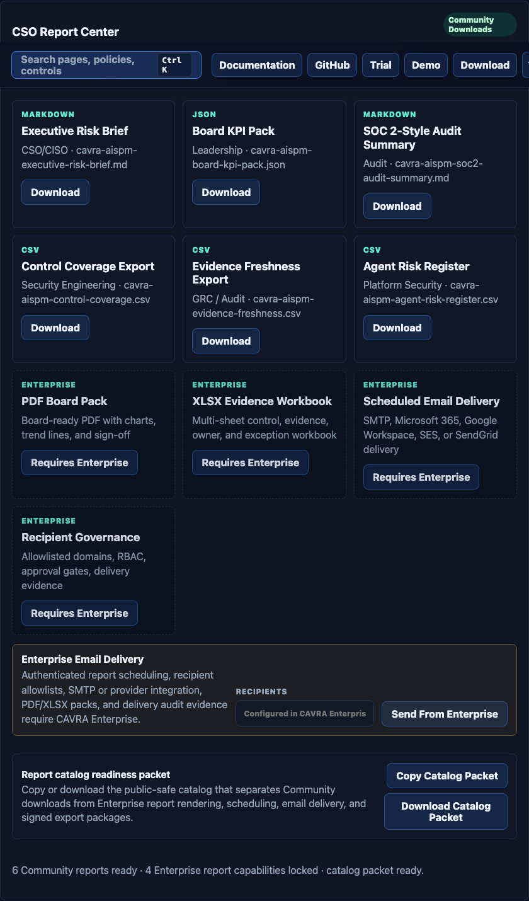

# Use Cases, Labs, And Example Workflows

This chapter gives practical ways to experience CAVRA.

## Tutorial Ladder

Complete the labs in this order if you are new:

1. Block a risky file write.
2. Route a legitimate high-risk change for approval.
3. Generate and verify evidence.
4. Register and check MCP trust.
5. Explore the sandbox GUI.
6. Read AISPM posture and report readiness.
7. Move from Community evidence to Enterprise production readiness.

## Lab 1: Block A Risky File Write

Goal: see runtime authority stop an unsafe agent change.

```bash
cavra evaluate write_file iam/admin-role.tf --json
```

Expected result: the decision explains whether the write is allowed, denied, or routed for approval. Use the result as input to an approval or evidence workflow.

Why it matters: identity and infrastructure files are high-impact resources. An agent may be allowed to propose changes, but CAVRA can require a human decision before the change proceeds.

## Lab 2: Approval-Routed Change

Goal: see human approval become part of the evidence chain.

```bash
cavra approval create /tmp/cavra-decision.json --requested-by developer
cavra approval list --state pending
cavra approval approve apr_123 --actor platform-security --reason "Reviewed scoped production change"
```

Expected result: the approval record can be audited and referenced by later evidence.

## Lab 3: Evidence Bundle

Goal: create proof of governance.

```bash
cavra evidence bundle --output .cavra/evidence/latest
cavra evidence verify .cavra/evidence/latest
```

Expected result: evidence can be verified, indexed, searched, exported, or used by CI/CD.

Screenshot target: after creating the bundle, open the sandbox Evidence view and compare the GUI summary with the CLI result.

## Lab 4: MCP Trust Check

Goal: govern tool calls, not just files.

```bash
cavra registry mcp-register github-mcp --trust-tier approved --approval-state approved --capability repository --tool create_pull_request
cavra registry mcp-check github-mcp create_pull_request --capability repository
```

Expected result: CAVRA has a record of which MCP tools are trusted for which actions.

## Lab 5: Sandbox Walkthrough

Goal: experience the GUI.

1. Start the sandbox.
2. Open Dashboard.
3. Run the flagship scenario.
4. Open Evidence.
5. Open AI Posture.
6. Export a public-safe readiness packet.


## Lab 6: Generate A Compliance Report Path

Goal: understand the relationship between runtime decisions and report output.

1. Run the flagship demo.
2. Generate evidence.
3. Verify evidence.
4. Open AI Posture in the sandbox.
5. Open the Report Center panel.
6. Identify findings, coverage, delivery state, and blocker status.



## Lab 7: Enterprise Report Delivery Readiness

Goal: understand the production condition.

Enterprise users configure real tenant inputs, real connector credentials, SMTP or report provider settings, and runtime workflows. Then they run source validators and the final production gate. The completion condition is `ready_for_aispm_production: true` with no blockers.

## Case Study 1: Prevent A Cloud Bill Disaster

Beginning: a platform team sees a sudden cloud bill spike after a quarter-end test cycle. A developer asks an AI agent to "clean up unused Kubernetes resources and reduce the bill before Monday." The request is sensible. The agent reads manifests, compares namespace activity, and finds old workloads. It also notices that one namespace named `production` appears idle because the workload moved to a different autoscaling profile during the weekend.

Without CAVRA, the agent may choose speed over authority. It may propose or run:

```bash
kubectl delete namespace production
```

The agent can explain the action convincingly: unused namespace, cost pressure, cleanup request, no recent pods. The problem is that the namespace is not unused; it is temporarily quiet. The deletion would remove production configuration, trigger incident response, and turn a cost cleanup into an outage.

Middle: with CAVRA in the path, the command is evaluated before execution:

```bash
cavra evaluate execute_command "kubectl delete namespace production" --json
```

CAVRA recognizes a destructive command against a production resource. The policy returns `deny` or `requires_approval`, depending on the organization's route. The agent can still inspect cluster state, summarize cost drivers, identify non-production cleanup candidates, and draft a pull request. It cannot silently delete production.

The evidence records:

- the actor and requested command;
- the production target;
- the matching policy rule;
- the decision and reason;
- the approval route, if the action is legitimate;
- the evidence expected before any production-impacting cleanup proceeds.

End: the platform owner approves only a scoped cleanup for non-production namespaces. The team reduces spend without an outage. AISPM records that a high-risk production deletion path was governed, that evidence exists, and that the control is covered for future agent workflows.

Before CAVRA, the team had an agent with shell access and after-the-fact logs. After CAVRA, the team has AI-assisted cleanup with runtime authority, human approval where needed, and audit-ready evidence.

## Case Study 2: Pass A SOX Change-Control Review

Scenario: an enterprise finance platform uses AI-assisted code changes for release automation. Auditors ask whether AI-generated changes can bypass protected branches or change deployment workflows without review.

CAVRA pattern:

- Direct push to `main` is blocked.
- Pull requests require CAVRA evidence and AI attestation.
- Production workflow edits require approval.
- Evidence bundles are retained and linked to release packets.
- AISPM reports coverage, findings, exceptions, and report readiness.

Outcome: the team can show not only that controls exist, but that agent actions passed through those controls.

## Case Study 3: Govern MCP Tool Expansion

Scenario: a team adds several MCP servers for issue tracking, repository operations, and filesystem access. Developers want fast agent workflows; security wants assurance that untrusted tools cannot touch sensitive resources.

CAVRA pattern:

- Register approved MCP servers and capabilities.
- Block unknown filesystem tools.
- Route repository mutation tools for approval when they touch protected branches.
- Generate evidence for each trust decision.

Outcome: MCP adoption continues without treating every tool as equally trusted.

## Case Study 4: Run An Enterprise AISPM Trial

Scenario: an evaluator wants to decide whether CAVRA is ready for a production pilot.

CAVRA pattern:

- Configure trial tenant, evaluator roles, and report recipients.
- Run guided labs with real runtime workflows.
- Validate connector delivery and SMTP/provider report delivery.
- Collect evidence into a trial room.
- Run production readiness validators.
- Require the final packet to return `ready_for_aispm_production: true`.

Outcome: pilot readiness is based on evidence and blockers, not sales promises.

## Use Case Map

| Use case | CAVRA surface |
| --- | --- |
| Local agent governance | CLI, policy, evidence |
| Pull request control | CLI, CI/CD, attestation |
| MCP tool governance | Agent registry, MCP trust registry |
| Cloud and IaC control | Policy engine, approvals, runtime decisions |
| Executive posture | AISPM, Report Center |
| Enterprise trial | Trial guide, labs, evidence room |
| Production readiness | Live validators, production gate |

## End-To-End Practice Scenario

Use this single practice scenario after the individual labs:

```bash
cavra demo before-the-agent-acts
cavra policy explain execute_command "terraform apply -auto-approve"
cavra evaluate write_file iam/admin-role.tf --json > /tmp/cavra-decision.json
cavra approval create /tmp/cavra-decision.json --requested-by developer
cavra evidence bundle --output .cavra/evidence/end-to-end
cavra evidence verify .cavra/evidence/end-to-end
```

Then open the sandbox and identify where the same story appears in the dashboard, evidence area, approvals, registry, and AISPM posture.

## Check Your Understanding

1. In the cloud-bill case study, which part of the request was legitimate and which part required authority?
2. Which lab proves the evidence path after a runtime decision?
3. Why is the Enterprise AISPM trial complete only when blockers are closed with real validation evidence?

## What's Next

Read [Reference Appendices](Textbook-14-Reference-Appendices.md) for canonical references, then use [Policy Language Reference](Textbook-15-Policy-Language-Reference.md) and [Troubleshooting And FAQ](Textbook-16-Troubleshooting-And-FAQ.md) as working field guides.
