# Conclusion: The Runtime Authority Revolution

AI agents are becoming operating actors. They do not merely suggest code. They inspect repositories, call tools, change files, run commands, trigger CI/CD, propose infrastructure updates, generate reports, and write explanations that sound confident even when the evidence is incomplete.

The organizations that benefit most from this change will not be the ones that give agents unlimited access. They will be the ones that give agents governed authority.

## The Shift

The old operating model asked humans to reconstruct what happened after the fact. Logs were scattered. Approvals lived in separate systems. Security review happened at pull request time or after deployment. Evidence was rebuilt for audits long after the decision had passed.

Agentic systems make that model too slow.

CAVRA changes the operating question from "what did the agent do?" to "should this agent be allowed to do this now, under this policy, with this evidence, for this tenant, through this tool?"

That question belongs before the action.

## A Complete Success Story

A platform team adopts an AI coding agent to reduce toil in its Kubernetes estate. At first, the agent is used for harmless cleanup: describing stale namespaces, finding unused manifests, and suggesting safer defaults. Then a Friday request arrives: "clean up unused production resources and reduce the cloud bill."

Without runtime authority, the agent may decide that broad deletion is the fastest path. It may generate a plausible explanation. It may run a destructive command if shell access is available. The bill may fall, but so might production.

With CAVRA, the story changes:

1. The agent proposes `kubectl delete namespace production`.
2. CAVRA normalizes the action as a high-risk shell command against a production resource.
3. Policy blocks the command or routes it for approval.
4. The agent is still allowed to inspect state, list candidates, and propose a pull request.
5. A human reviews the scoped change, approves only the safe cleanup, and evidence is generated.
6. AISPM records that the risky path was controlled, the cleanup happened through authority, and the evidence is ready for audit.

The outcome is not "AI was stopped." The outcome is better: AI was made useful without being made unbounded.

## What Readers Should Do Next

If you are a developer:

- Install Community Edition.
- Run the five-minute quick start.
- Add one policy that blocks a real risky action in your repository.
- Generate one evidence bundle and verify it.

If you are a security engineer:

- Map the agentic actions already happening in your organization.
- Identify which actions touch production, identity, secrets, CI/CD, cloud, or MCP tools.
- Write approval and evidence requirements for those actions.
- Use AISPM to turn decisions into posture.

If you are a platform owner:

- Put CAVRA into CI/CD and protected-branch workflows.
- Require signed evidence for high-risk pull requests.
- Test bypass paths, not just happy paths.
- Prepare Enterprise validation when SSO, tenant isolation, live connectors, and production reports are required.

If you are an executive or program owner:

- Ask whether AI agents can act without runtime authority.
- Ask whether evidence is created by the control path or reconstructed manually.
- Ask whether readiness is proven by live connectors, real tenants, real report delivery, and real workflows.
- Ask whether AISPM can show coverage, findings, owners, and blockers.

## Community Call To Action

CAVRA Community Edition exists so the operating model can be learned, inspected, extended, and improved in public. Use it. Break it in safe labs. Improve policy examples. File issues. Contribute documentation. Share safe patterns for agent governance.

The AI era needs more than faster automation. It needs a shared discipline for safe automation.

## Enterprise Call To Action

Enterprise teams should treat production readiness as evidence, not aspiration. The final gate is not complete until live validators run against real connectors, real tenant boundaries, real SMTP or report provider settings, real runtime workflows, and the final packet returns ready with no blockers.

That discipline may feel demanding. It is also what lets an organization say yes to agentic automation with confidence.

## Final Thought

Before the agent acts, authority should be checked.

While the agent acts, boundaries should be enforced.

After the agent acts, evidence should prove what happened.

Across many agents, tools, repositories, tenants, reports, and approvals, posture should be visible.

That is the CAVRA operating model. That is the runtime authority revolution.
