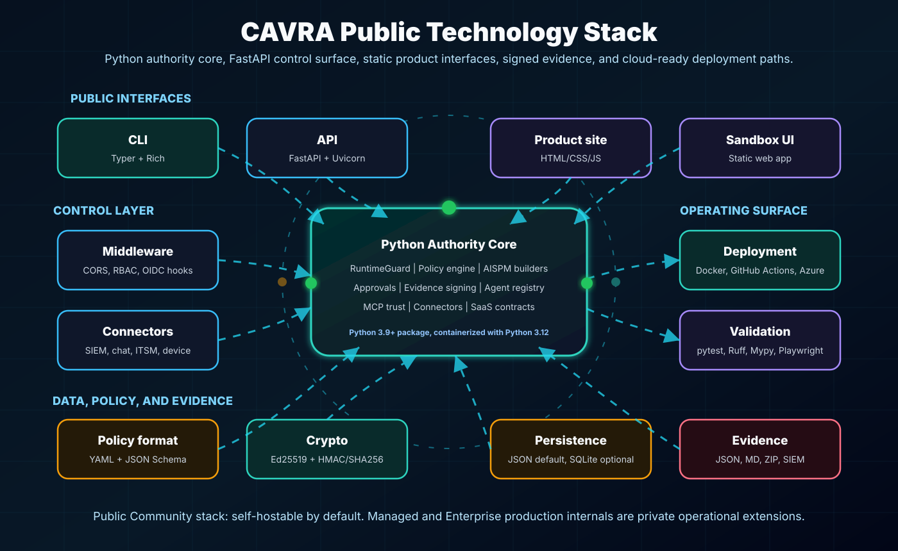
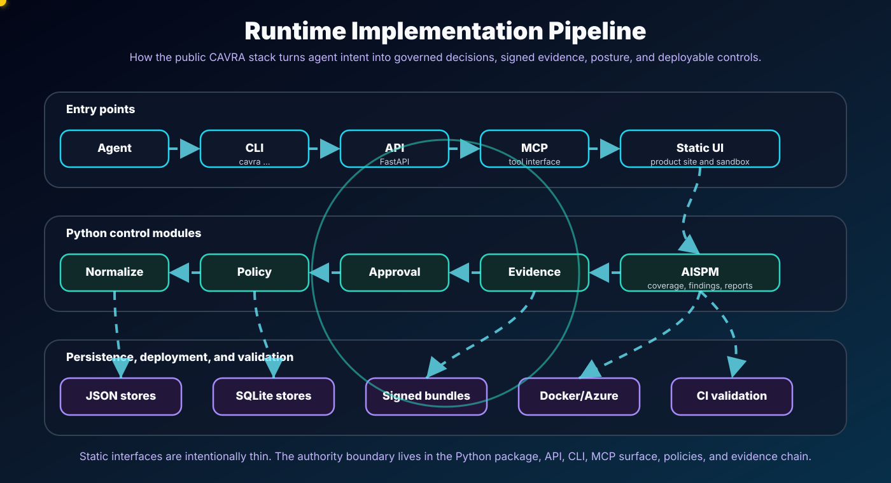
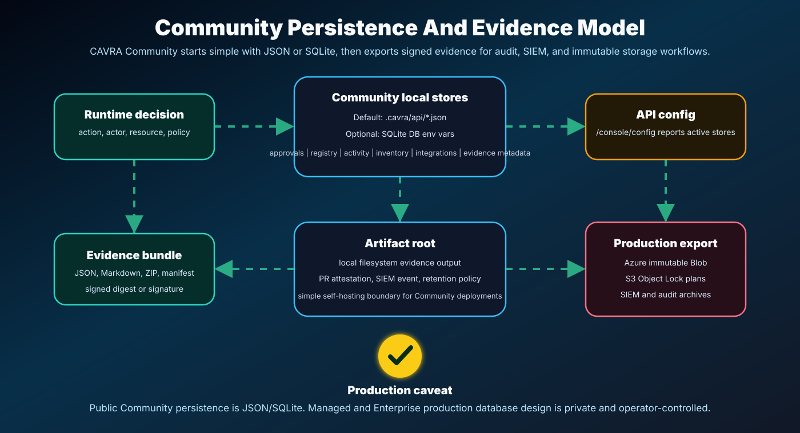

# Chapter 18: CAVRA Technology Stack And Implementation Model

## Short Answer

**CAVRA is primarily built in Python.**

The public Community product uses Python for its runtime authority core, CLI,
policy engine, evidence engine, API, MCP surface, and AISPM logic. The public
front ends are intentionally lightweight static HTML, CSS, and vanilla
JavaScript surfaces.



## Public Community Stack At A Glance

| Layer | Current public stack |
| --- | --- |
| Core language | **Python 3.9+**, containerized with **Python 3.12** |
| CLI | **Typer + Rich** |
| Backend/API | **FastAPI + Uvicorn** |
| Front end | **Static HTML, CSS, vanilla JavaScript** |
| Product website | Static HTML/CSS/JS commercial front door, separate from the sandbox UI |
| Sandbox UI | Static HTML/CSS/JS at `apps/sandbox-ui` |
| Middleware | FastAPI CORS middleware, approval/routing/provider config, connector delivery layer, MCP server interface |
| Database/storage | JSON file stores by default; optional **SQLite** stores for Community deployments |
| Evidence storage | Local filesystem evidence bundles, optional artifact root, export plans for S3 Object Lock or Azure immutable Blob |
| Policy format | YAML policies validated with JSON Schema |
| Crypto | `cryptography`, Ed25519, HMAC/SHA256 evidence and policy signing |
| Deployment | Docker, GitHub Actions, Azure Container Apps, Azure Static Web Apps, Azure Container Registry, Azure OIDC |
| Testing/validation | Pytest, Ruff, Black, Mypy for Python; Playwright for site validation |

## 1. Main Programming Language

CAVRA is a **Python package**. The package metadata requires **Python >= 3.9**,
classifies itself as Python 3 software, and exposes CLI entry points named
`cavra` and `cavra-mcp-server`.

Core Python dependencies include:

```text
typer
rich
python-dateutil
PyYAML
jsonschema
fastapi
uvicorn
cryptography
```

So the main implementation statement is:

> CAVRA backend, CLI, policy engine, evidence engine, runtime guard, API, MCP
> server, and AISPM logic are Python.

## 2. Backend/API Stack

The API backend is **FastAPI** running with **Uvicorn**.

The Azure deployment path runs the API container with:

```bash
uvicorn cavra.api:app --host 0.0.0.0 --port 8000
```

The Azure API Dockerfile uses `python:3.12-slim`, installs the Python package,
exposes port `8000`, and starts Uvicorn with `cavra.api:app`.

Inside `src/cavra/api.py`, the app is created with FastAPI and titled **CAVRA
API**. It adds FastAPI `CORSMiddleware` when `CAVRA_CORS_ORIGINS` is configured.

Backend responsibilities include:

- runtime decision evaluation;
- approvals;
- evidence metadata;
- AISPM posture and reporting surfaces;
- registries;
- connectors;
- endpoint and release operations;
- SaaS and managed-control public contracts;
- health, version, and configuration endpoints.

The API exposes `/health`, `/version`, and `/console/config`. The config
endpoint reports which storage backends are active and whether approval
providers, connectors, OIDC, RBAC, evidence artifacts, and CORS are configured.

## 3. CLI Stack

The CLI is Python using **Typer** and **Rich**.

`src/cavra/cli.py` imports `typer`, `rich.console.Console`, and `rich.json.JSON`.
It wires in the core CAVRA modules: approvals, evidence, policy engine,
registry, integrations, SaaS control-plane contracts, release operations, and
runtime functions.

The package exposes the CLI through:

```toml
cavra = "cavra.cli:main"
```

Users interact with CAVRA through:

```bash
cavra ...
```

and through the API server.

## 4. Front End Stack

### Product Website

The commercial website at `cavra.mind-ops.cloud` is a static site, not a
React or Next.js application. It uses HTML, CSS, vanilla JavaScript, and brand
assets to present CAVRA Managed, Enterprise Subscription, Trial, AISPM, trust,
architecture, and resource paths.

### Sandbox UI

The public sandbox at `huzefaaa2.github.io/cavra` is also a static UI. Its
`index.html` links to `styles.css` and `site.js`, and it provides the
JavaScript-driven portal experience with command palette, themes, dashboard,
AISPM, architecture, trial, and documentation navigation.

The front-end answer is:

> Current public front ends are static HTML/CSS/vanilla JS. They are deployed
> as static websites. There is no React or Next.js front end in the current
> public Community repo.

## 5. Middleware And Integration Layer

CAVRA has several middleware-like control layers.

### FastAPI Middleware

The direct web middleware is FastAPI **CORS middleware**, enabled through:

```text
CAVRA_CORS_ORIGINS
```

### Approval, RBAC, And OIDC Layer

The API loads approval routing, provider config, RBAC rules, and OIDC config
from environment-configured files:

```text
CAVRA_APPROVAL_ROUTING_FILE
CAVRA_APPROVAL_PROVIDER_CONFIG
CAVRA_APPROVAL_RBAC_FILE
CAVRA_APPROVAL_OIDC_CONFIG
```

### Connector Layer

CAVRA has a connector and integration layer for providers such as:

```text
splunk
sentinel
datadog
webhook
slack
teams
jira
servicenow
jamf
intune
linux
```

Connector configs can be loaded from YAML or JSON. CAVRA builds request specs
for configured providers with URL, headers, auth, and body.

### MCP Server

CAVRA also ships an MCP-style server entry point, `cavra-mcp-server`. It exposes
tools such as:

```text
cavra.evaluate_action
cavra.check_file_read
cavra.check_file_write
cavra.check_command
cavra.check_git_operation
cavra.check_mcp_tool_call
cavra.explain_decision
cavra.generate_pr_attestation
cavra.export_evidence
cavra.policy_list
cavra.policy_validate
```

That makes CAVRA usable as a governance tool surface for AI coding agents and
agent workflows.



## 6. Database And Persistence

### Current Community Storage

CAVRA Community uses **JSON file stores by default** and **SQLite optionally**.

In the API startup code, evidence, approvals, registry, activity, inventory, and
integration stores are selected like this:

- if an environment variable points to a SQLite DB path, use a SQLite-backed
  store;
- otherwise use a JSON file path under `.cavra/api/...`.

Examples:

```text
CAVRA_EVIDENCE_METADATA_DB -> SQLiteEvidenceMetadataStore
else .cavra/api/evidence-metadata.json

CAVRA_APPROVAL_DB -> SQLiteApprovalStore
else .cavra/api/approvals.json

CAVRA_REGISTRY_DB -> SQLiteRegistryStore
else .cavra/api/registry.json

CAVRA_ACTIVITY_DB -> SQLiteActivityStore
else .cavra/api/activity.json

CAVRA_INVENTORY_DB -> SQLiteInventoryStore
else .cavra/api/inventory.json

CAVRA_INTEGRATION_DB -> SQLiteIntegrationStore
else .cavra/api/integrations.json
```

The Azure deployment guide also lists these optional SQLite variables.

### SQLite Evidence Example

The evidence module imports `sqlite3` and defines `SQLiteEvidenceMetadataStore`.
It creates an `evidence_metadata` table with session ID, timestamps, signer,
decision counts, and JSON payload.

### Production Caveat

Azure Container Apps filesystem storage is not a durable database. For a
Community demo, SQLite can be mounted on Azure Files or state can be ephemeral.
For production multi-tenant SaaS, replace file-backed stores with an
Enterprise-managed database design.

The precise statement is:

> Community uses JSON/SQLite. Managed or Enterprise production database
> architecture is intentionally private and operator-defined.



## 7. Policy Engine And Data Formats

CAVRA policies are **YAML** files validated against **JSON Schema**.

The policy engine loads `policy.yaml`, uses `yaml.safe_load`, validates with
`jsonschema.Draft202012Validator`, and supports policy normalization, overlays,
diffs, and signatures.

Policy signing uses Ed25519 from `cryptography`.

Evidence artifacts are mostly:

```text
JSON
Markdown
ZIP
SIEM/export payloads
Retention policy JSON
Manifest JSON
```

Evidence bundles can include:

```text
evidence.json
pr-attestation.md
compliance-mapping.md
siem-event.json
sandbox-run-summary.json
retention-policy.json
manifest.json
```

Evidence manifests can be signed with Ed25519, HMAC SHA-256, or a plain SHA-256
digest depending on configuration.

## 8. Deployment And Infrastructure Stack

### Community Azure Deployment

CAVRA Community can be published as a self-hosted Azure deployment with:

- FastAPI backend on **Azure Container Apps**;
- static sandbox UI on **Azure Static Web Apps**;
- container image build and publish through **Azure Container Registry**;
- GitHub Actions deployment through **Azure OIDC**.

The Azure deployment artifacts are:

```text
docker/Dockerfile.azure-api
.github/workflows/deploy-azure-api.yml
.github/workflows/deploy-azure-static-ui.yml
apps/sandbox-ui/config.js
src/cavra/api.py
```

### GitHub Actions

The API deployment workflow uses:

- `actions/checkout`;
- `actions/setup-python`;
- `azure/login@v2` with OIDC;
- `azure/container-apps-deploy-action@v1`;
- `azure/cli@v2`;
- curl health checks.

The static UI workflow uses Node and Python to validate and copy the static UI,
then deploy it to Azure Static Web Apps.

### Product Website Deployment

The product website is a static artifact. Validation checks the required page
markers, simulator, evidence tabs, role switcher, desktop/mobile layout, and
screenshots before deployment.

## 9. Testing And Validation Stack

Python dev dependencies include:

```text
pytest
ruff
httpx
black
mypy
build
twine
```

The product and sandbox validation package uses **Playwright**. Validation
scripts check sandbox visual behavior, hosted sandbox pages, and product-site
interaction coverage.

## 10. Overall Architecture Summary

```text
Static Product Website
  -> HTML/CSS/JS at cavra.mind-ops.cloud

Static Sandbox UI
  -> HTML/CSS/JS at GitHub Pages or Azure Static Web Apps
       -> optional API calls

FastAPI Backend
  -> Python / Uvicorn / Container Apps
       -> Core CAVRA Python Modules
          -> RuntimeGuard
          -> Policy engine
          -> Approval routing
          -> Evidence generation/signing
          -> AISPM builders
          -> Registry / MCP trust
          -> Connectors
          -> Managed/SaaS public contracts

Persistence
  -> JSON file stores by default
  -> Optional SQLite stores
  -> Filesystem evidence artifacts

Deployment
  -> Docker
  -> GitHub Actions
  -> Azure Container Apps
  -> Azure Static Web Apps
  -> Azure Container Registry
  -> Azure OIDC
```

## Important Caveat

This chapter describes the **public CAVRA repository and public deployment
model**. The Managed and Enterprise production stack is not fully visible in the
public repo.

Public documentation states that Trial, Managed, and Enterprise Subscription
Azure deployments use a separate private workflow set in `Huzefaaa2/cavra-enterprise`
for the trial portal, entitlement workflow, private packages, managed control
plane, connector jobs, authenticated operator UI, and AISPM production
readiness gate.

The safest product statement is:

> Public CAVRA is Python + FastAPI + Typer/Rich + static HTML/CSS/JS +
> JSON/SQLite + Docker/Azure/GitHub Actions. Managed and Enterprise production
> internals are private and should be treated as a separate operational stack.

## Where To Go Next

- Install and run CAVRA Community: [Install And Deploy CAVRA](Textbook-05-Install-And-Deploy-CAVRA.md)
- Understand product boundaries: [Product Model, Licensing, And Capability Boundaries](Textbook-04-Editions-Licensing-And-Feature-Boundaries.md)
- Learn the CLI: [CAVRA CLI Command Reference](Textbook-08-CAVRA-CLI-Command-Reference.md)
- Study deployment patterns: [Operations, Integrations, And Deployment Patterns](Textbook-12-Operations-Integrations-And-Deployment-Patterns.md)
- Continue to the closing chapter: [The Runtime Authority Revolution](Textbook-17-The-Runtime-Authority-Revolution.md)
